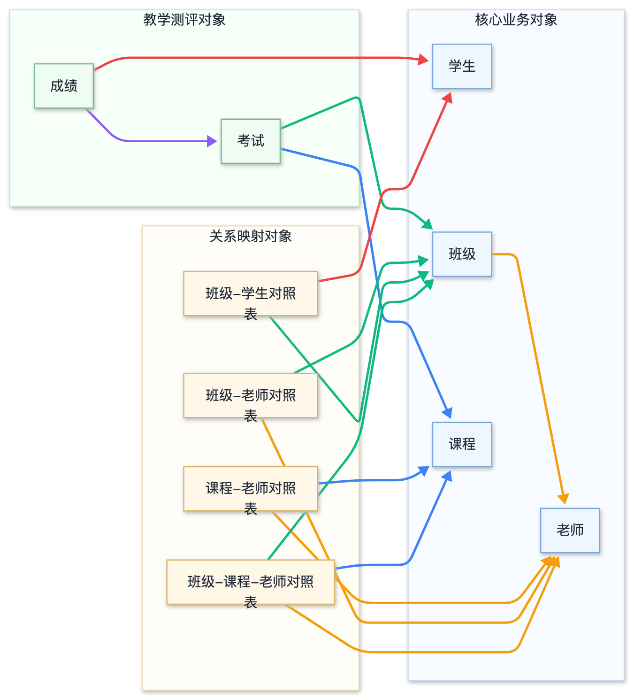
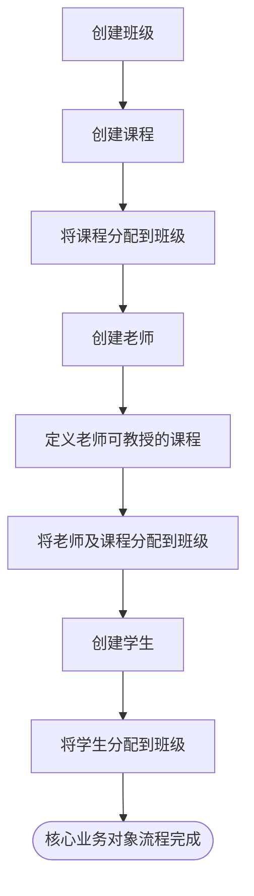
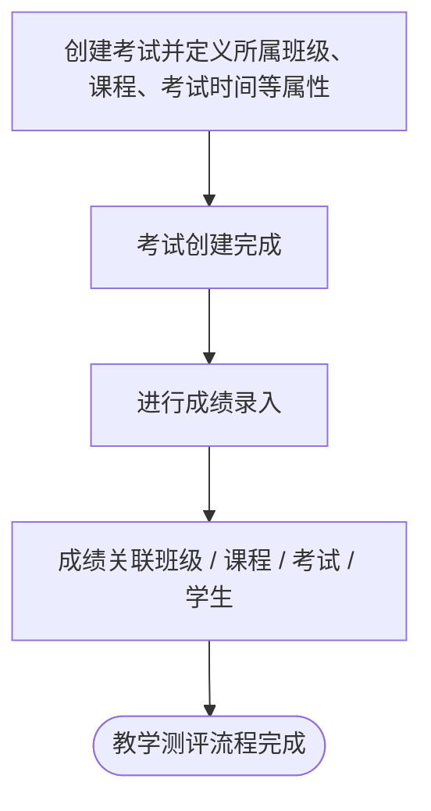

# 学校管理平台需求文档

## 目录索引

- [1. 产品概述](#1-产品概述)
  - [1.1 产品名称](#11-产品名称)
  - [1.2 产品描述](#12-产品描述)
  - [1.3 核心特点](#13-核心特点)
  - [1.4 产品形式](#14-产品形式)
- [2. 业务对象说明](#2-业务对象说明)
  - [2.1 文档说明](#21-文档说明)
  - [2.2 业务对象总览](#22-业务对象总览)
  - [2.3 通用关系规则](#23-通用关系规则)
  - [2.4 业务对象说明](#24-业务对象说明)
    - [2.4.1 学生](#241-学生)
      - [2.4.1.1 业务说明](#2411-业务说明)
      - [2.4.1.2 属性](#2412-属性)
      - [2.4.1.3 审计信息](#2413-审计信息)
      - [2.4.1.4 与其他对象的关系](#2414-与其他对象的关系)
    - [2.4.2 老师](#242-老师)
      - [2.4.2.1 业务说明](#2421-业务说明)
      - [2.4.2.2 属性](#2422-属性)
      - [2.4.2.3 审计信息](#2423-审计信息)
      - [2.4.2.4 与其他对象的关系](#2424-与其他对象的关系)
    - [2.4.3 班级](#243-班级)
      - [2.4.3.1 业务说明](#2431-业务说明)
      - [2.4.3.2 属性](#2432-属性)
      - [2.4.3.3 审计信息](#2433-审计信息)
      - [2.4.3.4 与其他对象的关系](#2434-与其他对象的关系)
    - [2.4.4 课程](#244-课程)
      - [2.4.4.1 业务说明](#2441-业务说明)
      - [2.4.4.2 属性](#2442-属性)
      - [2.4.4.3 审计信息](#2443-审计信息)
      - [2.4.4.4 与其他对象的关系](#2444-与其他对象的关系)
    - [2.4.5 考试](#245-考试)
      - [2.4.5.1 业务说明](#2451-业务说明)
      - [2.4.5.2 属性](#2452-属性)
      - [2.4.5.3 审计信息](#2453-审计信息)
      - [2.4.5.4 与其他对象的关系](#2454-与其他对象的关系)
    - [2.4.6 成绩](#246-成绩)
      - [2.4.6.1 业务说明](#2461-业务说明)
      - [2.4.6.2 属性](#2462-属性)
      - [2.4.6.3 审计信息](#2463-审计信息)
      - [2.4.6.4 与其他对象的关系](#2464-与其他对象的关系)
    - [2.4.7 课程-老师对照表](#247-课程-老师对照表)
      - [2.4.7.1 业务说明](#2471-业务说明)
      - [2.4.7.2 属性](#2472-属性)
      - [2.4.7.3 与其他对象的关系](#2473-与其他对象的关系)
    - [2.4.8 班级-学生对照表](#248-班级-学生对照表)
      - [2.4.8.1 业务说明](#2481-业务说明)
      - [2.4.8.2 属性](#2482-属性)
      - [2.4.8.3 与其他对象的关系](#2483-与其他对象的关系)
    - [2.4.9 班级-课程-老师对照表](#249-班级-课程-老师对照表)
      - [2.4.9.1 业务说明](#2491-业务说明)
      - [2.4.9.2 属性](#2492-属性)
      - [2.4.9.3 与其他对象的关系](#2493-与其他对象的关系)
  - [2.5 主要业务关系总结](#25-主要业务关系总结)
    - [2.5.1 基础对象关系](#251-基础对象关系)
    - [2.5.2 教学安排关系](#252-教学安排关系)
    - [2.5.3 考试与成绩关系](#253-考试与成绩关系)
  - [2.6 待确认项](#26-待确认项)
- [3. 业务流程说明](#3-业务流程说明)
  - [3.1 流程概述](#31-流程概述)
  - [3.2 核心业务对象流程](#32-核心业务对象流程)
  - [3.3 教学测评对象流程](#33-教学测评对象流程)
- [4. 附件](#4-附件)
  - [4.1 缩写说明](#41-缩写说明)

## 1. 产品概述

### 1.1 产品名称

学校管理平台

### 1.2 产品描述

学校管理平台是一个面向学校教学与管理场景的现代化管理系统，覆盖学生、教师、班级、课程、考试与成绩等核心业务。系统采用灵活的业务配置机制，支持不同学校在课程体系、考试规则和成绩管理模式上的差异化需求，并可根据实际业务发展进行快速扩展与调整。通过统一的数据管理与流程协同，平台帮助学校提升教学运营效率与数字化管理能力。

### 1.3 核心特点

- 覆盖学生、教师、班级、课程、考试与成绩等核心教学管理场景。
- 支持课程体系、考试规则和成绩管理模式的灵活配置，适配不同学校的业务差异。
- 通过统一数据管理与流程协同，提升学校日常教学运营效率和数字化管理水平。

### 1.4 产品形式

学校管理平台是一个网页型应用，用户可通过访问系统网址登录并使用平台各项功能。

## 2. 业务对象说明

业务对象关系图源文件：[business-object-diagram.mmd](business-object-diagram.mmd)  
业务对象关系图预览：



### 2.1 文档说明

版本：v0.2  
来源：根据原始业务对象图整理  
说明：本文档从产品业务对象角度描述对象、属性与业务关系；属性中的数据类型、是否可为空、默认值、主键、外键、唯一索引等信息，均来自图片中可识别内容。

### 2.2 业务对象总览

系统当前包含以下业务对象：

1. 学生
2. 老师
3. 班级
4. 课程
5. 考试
6. 成绩
7. 课程-老师对照表
8. 班级-学生对照表
9. 班级-课程-老师对照表

### 2.3 通用关系规则

图片中标注了以下关系建模规则：

1. 如果两个对象之间只有 `1:n` 或 `n:1` 关系，优先通过外键表达关系；如需统一管理归属关系或为后续扩展预留结构，也可以通过对照表表达。
2. 如果两个对象之间是 `m:n` 关系，则需要使用对照表表达关系。

### 2.4 业务对象说明

#### 2.4.1 学生

##### 2.4.1.1 业务说明

学生是学校管理系统中的核心管理对象，用于记录学生的基础信息、入学信息、联系方式以及与班级、考试、成绩相关的业务关系。

学生可以被分配到班级中，并通过所属班级参与考试；考试结果通过成绩对象进行记录。

##### 2.4.1.2 属性

| 属性 | 数据类型 | 是否可为空 | 默认值 | 索引 / 约束 | 业务说明 |
|---|---|---:|---|---|---|
| ID | 整数 | 否 | 自增 | 主键 | 学生唯一标识 |
| 姓名 | 字符串（128个字） | 否 | - | - | 学生姓名 |
| 性别 | 字符串 | 否 | - | - | 学生性别 |
| 出生日期 | 日期 | 否 | - | - | 学生出生日期 |
| 入学时间 | 数字 | 否 | - | - | 学生入学时间 |
| 居住地 | 字符串 | 否 | - | - | 学生居住地址 |
| 联系电话 | 字符串 | 否 | - | - | 学生联系电话 |
| 备注 | 字符串 | 是 | - | - | 学生备注信息 |

说明：学生与班级保持“多对一”业务关系，但当前文档不在学生属性中新增“班级ID”字段，班级归属通过“班级-学生对照表”维护。当前版本仅保留每个学生最新的一条班级关系记录，不保留历史班级记录。

##### 2.4.1.3 审计信息

| 属性 | 数据类型 | 是否可为空 | 默认值 | 索引 / 约束 | 业务说明 |
|---|---|---:|---|---|---|
| 创建人ID | 整数 | 否 | - | - | 创建该学生信息的用户 |
| 创建时间 | 日期时间 | 否 | - | - | 学生信息创建时间 |
| 最后更新时间 | 日期时间 | 否 | - | - | 学生信息最后更新时间 |
| 最后更新人ID | 整数 | 否 | - | - | 最后更新该学生信息的用户 |
| 删除时间 | 日期时间 | 是 | 空 | - | 学生信息逻辑删除时间 |

##### 2.4.1.4 与其他对象的关系

| 关联对象 | 关系 | 关系说明 |
|---|---|---|
| 班级 | 多对一 | 一个学生只对应一个当前班级，一个班级可以包含多个学生；当前系统仅保留学生与班级的最新有效关系，班级-学生对照表中每个学生只允许存在一条有效关系记录 |
| 成绩 | 一对多 | 一个学生可以拥有多条成绩记录 |
| 考试 | 间接关系 | 学生通过所属班级参与考试 |

#### 2.4.2 老师

##### 2.4.2.1 业务说明

老师用于记录学校教师的基础信息、联系方式、工作状态，以及其与课程、班级之间的授课关系。

老师可以教授多门课程，也可以在多个班级中承担教学任务。

##### 2.4.2.2 属性

| 属性 | 数据类型 | 是否可为空 | 默认值 | 索引 / 约束 | 业务说明 |
|---|---|---:|---|---|---|
| ID | 整数 | 否 | 自增 | 主键 | 老师唯一标识 |
| 姓名 | 字符串（128个字） | 否 | - | - | 老师姓名 |
| 性别 | 枚举（男 / 女 / 其它） | 否 | - | - | 老师性别 |
| 联系电话 | 字符串 | 否 | - | - | 老师联系电话 |
| 生日 | 日期 | 否 | - | - | 老师生日 |
| 居住地 | 字符串 | 是 | - | - | 老师居住地址 |
| 老师工作状态（is active） | boolean（true / false） | 否 | true | - | 老师当前是否在职 |

##### 2.4.2.3 审计信息

| 属性 | 数据类型 | 是否可为空 | 默认值 | 索引 / 约束 | 业务说明 |
|---|---|---:|---|---|---|
| 创建人ID | 整数 | 否 | - | - | 创建该老师信息的用户 |
| 创建时间 | 日期时间 | 否 | - | - | 老师信息创建时间 |
| 最后更新时间 | 日期时间 | 否 | - | - | 老师信息最后更新时间 |
| 最后更新人ID | 整数 | 否 | - | - | 最后更新该老师信息的用户 |
| 删除时间 | 日期时间 | 是 | 空 | - | 老师信息逻辑删除时间 |

##### 2.4.2.4 与其他对象的关系

| 关联对象 | 关系 | 关系说明 |
|---|---|---|
| 课程 | 多对多 | 老师可通过“课程-老师对照表”与课程建立授课能力关系 |
| 班级 | 一对多 / 多对多组合关系 | 老师既可通过班级中的“班主任ID”担任班主任，也可通过“班级-课程-老师对照表”参与具体班级教学安排；除班主任和具体授课安排外，系统暂不单独维护老师与班级的其他关系 |
| 班级 + 课程 | 多对多组合关系 | 老师可通过“班级-课程-老师对照表”定义在某班级教授某课程 |

#### 2.4.3 班级

##### 2.4.3.1 业务说明

班级是学校教学组织的核心对象，用于组织学生、关联班主任、安排课程和考试。

班级既可以与学生建立关系，也可以与老师、课程、考试建立业务关系。

##### 2.4.3.2 属性

| 属性 | 数据类型 | 是否可为空 | 默认值 | 索引 / 约束 | 业务说明 |
|---|---|---:|---|---|---|
| 班级ID | 整数 | 否 | 自增 | 主键 | 班级唯一标识 |
| 班级名称 | 字符串 | 否 | - | 唯一索引 | 班级名称，不能重复 |
| 班主任ID | 整数 | 否 | - | 外键 | 班级班主任，对应老师 |
| 教室地址 | 字符串 | 否 | - | - | 班级教室地址 |
| 备注信息 | 字符串 | 是 | - | - | 班级备注信息 |

##### 2.4.3.3 审计信息

| 属性 | 数据类型 | 是否可为空 | 默认值 | 索引 / 约束 | 业务说明 |
|---|---|---:|---|---|---|
| 创建人ID | 整数 | 否 | - | - | 创建该班级信息的用户 |
| 创建时间 | 日期时间 | 否 | - | - | 班级信息创建时间 |
| 最后更新时间 | 日期时间 | 否 | - | - | 班级信息最后更新时间 |
| 最后更新人ID | 整数 | 否 | - | - | 最后更新该班级信息的用户 |
| 删除时间 | 日期时间 | 是 | 空 | - | 班级信息逻辑删除时间 |

##### 2.4.3.4 与其他对象的关系

| 关联对象 | 关系 | 关系说明 |
|---|---|---|
| 学生 | 一对多 | 一个班级对应多个学生，一个学生只对应一个当前班级 |
| 老师 | 一对多 / 多对多组合关系 | 班级通过“班主任ID”关联班主任，并通过“班级-课程-老师对照表”管理具体授课安排；除班主任和具体授课安排外，系统暂不单独维护班级与老师的其他关系 |
| 课程 | 多对多 | 通过“班级-课程-老师对照表”管理班级课程安排 |
| 考试 | 一对多 | 一个班级可以组织多场考试 |
| 成绩 | 间接关系 | 班级通过考试与成绩发生业务关系 |

#### 2.4.4 课程

##### 2.4.4.1 业务说明

课程用于定义学校中可教学、可考试、可与老师和班级发生关系的科目。

例如：数学、地理、英语等。

课程本身定义课程名称等基础信息，具体由哪个老师在某个班级授课，需要通过对照表表达。

##### 2.4.4.2 属性

| 属性 | 数据类型 | 是否可为空 | 默认值 | 索引 / 约束 | 业务说明 |
|---|---|---:|---|---|---|
| 课程ID | 整数 | 否 | - | 主键 | 课程唯一标识 |
| 课程名称 | 字符串（128个字） | 否 | - | 唯一索引；不能重复 | 课程名称 |

##### 2.4.4.3 审计信息

| 属性 | 数据类型 | 是否可为空 | 默认值 | 索引 / 约束 | 业务说明 |
|---|---|---:|---|---|---|
| 创建人ID | 整数 | 否 | - | - | 创建该课程信息的用户 |
| 创建时间 | 日期时间 | 否 | - | - | 课程信息创建时间 |
| 最后更新时间 | 日期时间 | 否 | - | - | 课程信息最后更新时间 |
| 最后更新人ID | 整数 | 否 | - | - | 最后更新该课程信息的用户 |
| 删除时间 | 日期时间 | 是 | 空 | - | 课程信息逻辑删除时间 |

##### 2.4.4.4 与其他对象的关系

| 关联对象 | 关系 | 关系说明 |
|---|---|---|
| 老师 | 多对多 | 通过“课程-老师对照表”表示哪些老师可以教授哪些课程 |
| 班级 | 多对多 | 通过“班级-课程-老师对照表”表示某班级有哪些课程 |
| 考试 | 一对多 | 一个课程可以对应多次考试 |
| 成绩 | 间接关系 | 成绩通过考试与课程发生关系 |

#### 2.4.5 考试

##### 2.4.5.1 业务说明

考试用于描述学校中的一次考试活动。

考试通常属于某个班级、某个课程，并在某个学年/学期内发生。考试产生后，可以为参加考试的学生记录成绩。

##### 2.4.5.2 属性

| 属性 | 数据类型 | 是否可为空 | 默认值 | 索引 / 约束 | 业务说明 |
|---|---|---:|---|---|---|
| 学年/学期 | 字符串 | 否 | - | - | 考试所属学年或学期 |
| 考试ID | 整数 | 否 | - | 主键 | 考试唯一标识 |
| 课程ID | 整数 | 否 | - | 外键 | 考试对应课程 |
| 班级ID | 整数 | 否 | - | 外键 | 考试对应班级 |
| 考试名称 | 字符串（128个字） | 否 | - | - | 考试名称 |
| 考试开始时间 | 日期时间 | 否 | - | - | 考试开始时间 |
| 考试类型 | 枚举（test / KA / LEK） | 否 | - | - | 考试类型 |
| 考试状态 | 枚举（未开始 / 进行中 / 已结束 / 已取消） | 否 | 未开始 | - | 考试当前状态 |
| 考试地点 | 字符串（128个字） | 否 | - | - | 考试地点 |

##### 2.4.5.3 审计信息

| 属性 | 数据类型 | 是否可为空 | 默认值 | 索引 / 约束 | 业务说明 |
|---|---|---:|---|---|---|
| 创建人ID | 整数 | 否 | - | - | 创建该考试信息的用户 |
| 创建时间 | 日期时间 | 否 | - | - | 考试信息创建时间 |
| 最后更新时间 | 日期时间 | 否 | - | - | 考试信息最后更新时间 |
| 最后更新人ID | 整数 | 否 | - | - | 最后更新该考试信息的用户 |
| 删除时间 | 日期时间 | 是 | 空 | - | 考试信息逻辑删除时间 |

##### 2.4.5.4 与其他对象的关系

| 关联对象 | 关系 | 关系说明 |
|---|---|---|
| 班级 | 多对一 | 一场考试属于一个班级 |
| 课程 | 多对一 | 一场考试属于一门课程 |
| 成绩 | 一对多 | 一场考试可以产生多条学生成绩 |
| 学生 | 间接关系 | 学生通过所属班级参与考试 |

#### 2.4.6 成绩

##### 2.4.6.1 业务说明

成绩用于记录学生在某次考试中的考试结果。

成绩对象连接学生和考试，用于表达“某个学生在某次考试中的分数和等级”。

例如：

> 张三，第一学期，数学考试，成绩为 95 分。

##### 2.4.6.2 属性

| 属性 | 数据类型 | 是否可为空 | 默认值 | 索引 / 约束 | 业务说明 |
|---|---|---:|---|---|---|
| 成绩ID | 整数 | 否 | 自增 | 主键 | 成绩唯一标识 |
| 学生ID | 整数 | 否 | - | 外键 | 成绩所属学生 |
| 考试ID | 整数 | 否 | - | 外键 | 成绩所属考试 |
| 成绩分数 | 小数 | 是 | - | - | 学生该次考试的分数 |
| 成绩等级 | 字符串（16个字） | 是 | - | - | 成绩等级，例如 A/B/C 或优秀/良好等 |

##### 2.4.6.3 审计信息

| 属性 | 数据类型 | 是否可为空 | 默认值 | 索引 / 约束 | 业务说明 |
|---|---|---:|---|---|---|
| 创建人ID | 整数 | 否 | - | - | 创建该成绩信息的用户 |
| 创建时间 | 日期时间 | 否 | - | - | 成绩信息创建时间 |
| 最后更新时间 | 日期时间 | 否 | - | - | 成绩信息最后更新时间 |
| 最后更新人ID | 整数 | 否 | - | - | 最后更新该成绩信息的用户 |
| 删除时间 | 日期时间 | 是 | 空 | - | 成绩信息逻辑删除时间 |

##### 2.4.6.4 与其他对象的关系

| 关联对象 | 关系 | 关系说明 |
|---|---|---|
| 学生 | 多对一 | 一条成绩属于一个学生 |
| 考试 | 多对一 | 一条成绩属于一次考试 |
| 课程 | 间接关系 | 成绩通过考试关联课程 |
| 班级 | 间接关系 | 成绩通过考试关联班级 |

#### 2.4.7 课程-老师对照表

##### 2.4.7.1 业务说明

课程-老师对照表用于描述老师与课程之间的可授课关系。

例如：

- 张三可以教授地理
- 李四可以教授数学

该对象表达的是“老师可以教哪些课程”，不一定代表某个具体班级的排课结果。

##### 2.4.7.2 属性

| 属性 | 数据类型 | 是否可为空 | 默认值 | 索引 / 约束 | 业务说明 |
|---|---|---:|---|---|---|
| ID | 整数 | 否 | 自增 | 主键 | 课程-老师关系唯一标识 |
| 课程ID | 整数 | 否 | - | 外键 | 对应课程 |
| 老师ID | 整数 | 否 | - | 外键 | 对应老师 |

##### 2.4.7.3 与其他对象的关系

| 关联对象 | 关系 | 关系说明 |
|---|---|---|
| 课程 | 多对一 | 一条关系记录对应一门课程 |
| 老师 | 多对一 | 一条关系记录对应一位老师 |

#### 2.4.8 班级-学生对照表

##### 2.4.8.1 业务说明

班级-学生对照表用于描述学生与班级之间的归属关系。

当前系统通过该对照表维护学生当前最新的班级归属关系，不保留完整转班历史。每个学生在该表中只保留一条关系记录，学生换班时直接更新该条记录；离班日期字段保留用于关系结束标记或后续扩展，但当前版本不用于保留历史记录。

##### 2.4.8.2 属性

| 属性 | 数据类型 | 是否可为空 | 默认值 | 索引 / 约束 | 业务说明 |
|---|---|---:|---|---|---|
| ID | 整数 | 否 | 自增 | 主键 | 班级-学生关系唯一标识 |
| 班级ID | 整数 | 否 | - | 外键 | 对应班级 |
| 学生ID | 整数 | 否 | - | 外键；唯一索引 | 对应学生；确保每个学生当前仅保留一条班级关系记录 |
| 进班日期 | 日期 | 否 | - | - | 学生进入该班级的日期 |
| 离班日期 | 日期 | 是 | - | - | 学生离开该班级的日期；为空表示当前仍在该班级 |

##### 2.4.8.3 与其他对象的关系

| 关联对象 | 关系 | 关系说明 |
|---|---|---|
| 班级 | 多对一 | 一条关系记录对应一个班级 |
| 学生 | 多对一 | 一条关系记录对应一个学生 |

#### 2.4.9 班级-课程-老师对照表

##### 2.4.9.1 业务说明

班级-课程-老师对照表用于描述实际教学安排：

> 某个班级的某门课程，由某位老师负责教授。

例如：

- 二年级三班，地理课，张三
- 二年级三班，英语课，李四

这是连接班级、课程、老师三个核心业务对象的教学安排对象。

##### 2.4.9.2 属性

| 属性 | 数据类型 | 是否可为空 | 默认值 | 索引 / 约束 | 业务说明 |
|---|---|---:|---|---|---|
| ID | 整数 | 否 | 自增 | 主键 | 班级-课程-老师关系唯一标识 |
| 班级ID | 整数 | 否 | - | 外键 | 对应班级 |
| 课程ID | 整数 | 否 | - | 外键 | 对应课程 |
| 老师ID | 整数 | 否 | - | 外键 | 对应老师 |
| 开始授课日期 | 日期 | 否 | - | - | 该教学安排的开始日期 |
| 结束授课日期 | 日期 | 是 | - | - | 该教学安排的结束日期 |

##### 2.4.9.3 与其他对象的关系

| 关联对象 | 关系 | 关系说明 |
|---|---|---|
| 班级 | 多对一 | 一条教学安排对应一个班级 |
| 课程 | 多对一 | 一条教学安排对应一门课程 |
| 老师 | 多对一 | 一条教学安排对应一位老师 |

### 2.5 主要业务关系总结

#### 2.5.1 基础对象关系

```text
学生 ←→ 班级
老师 ←→ 班级（班主任 / 教学安排）
老师 ←→ 课程
班级 ←→ 课程
```

这些关系中，存在多对多关系时，通过对照表表达；班级与老师的关系分别通过班主任外键和班级-课程-老师对照表表达。

#### 2.5.2 教学安排关系

```text
班级 + 课程 + 老师
  ↓
班级-课程-老师对照表
```

该关系用于描述具体教学安排，例如：

```text
二年级三班 - 地理课 - 张三
二年级三班 - 英语课 - 李四
```

#### 2.5.3 考试与成绩关系

```text
班级 + 课程
     ↓
    考试
     ↓
    成绩
     ↓
    学生
```

考试属于某个班级和某门课程；成绩属于某个学生和某次考试。

### 2.6 待确认项

当前无待确认项。

## 3. 业务流程说明

### 3.1 流程概述

系统的主要业务流程分为两大部分：

1. **核心业务对象流程**：涵盖班级、课程、老师和学生的创建与分配关系。
2. **教学测评对象流程**：涵盖考试的创建与成绩的录入。

### 3.2 核心业务对象流程

核心业务对象的整体流程如下：

1. **创建班级**：首先创建班级，作为后续一切对象关联的基础组织单元。
2. **创建课程并分配到班级**：创建课程后，将课程分配到对应的班级中。
3. **创建老师并建立课程关系**：创建老师时，定义该老师可以教授哪些课程；老师与课程建立关系后，再将老师及其可教授的课程分配到对应班级中。
4. **创建学生并分配到班级**：创建学生后，将学生分配到对应的班级中。



### 3.3 教学测评对象流程

教学测评对象的整体流程如下：

1. **创建考试**：基于已有的班级和课程，创建考试，并定义考试所属班级、对应课程、考试时间及其他相关属性。
2. **成绩录入**：考试创建完成后，基于该考试进行成绩录入，确保成绩能够关联到对应的班级、课程、考试和学生。



## 4. 附件

### 4.1 缩写说明

| 缩写 | 全称 | 说明 |
| --- | --- | --- |
| 待补充 | 待补充 | 待补充 |